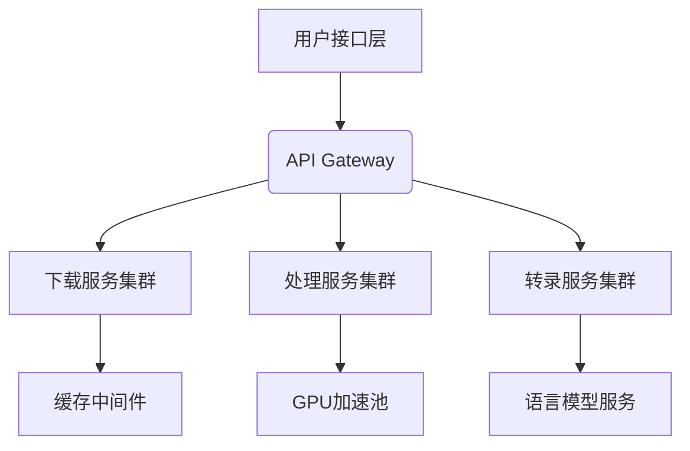

# Podcast 代理开发方案

## 一、需求分析
### 1.1 功能需求
- [x] 多源播客下载（HTTP/RTSP/P2P）
- [x] 音频格式智能转换
- [ ] 多语言字幕自动翻译
- [ ] 分布式任务调度

### 1.2 非功能需求
- 单任务处理时间 < 音频时长×0.8
- 支持千兆级音频文件处理
- 错误重试成功率 ≥ 99.9%

## 二、架构设计


## 三、阶段实施路径

### 阶段1：核心能力建设（已完成）
```gantt
dateFormat  YYYY-MM-DD
section 核心模块
下载引擎       :done,  des1, 2025-02-01, 5d
音频流水线     :done,  des2, 2025-02-06, 3d
语音识别集成   :done,  des3, 2025-02-08, 2d
```

### 阶段2：服务化改造
1. 容器化封装
2. REST API 开发
3. 任务队列实现
4. 负载均衡配置

### 阶段3：增强功能
- 智能章节分割
- 语音情感分析
- 多说话人识别
- 敏感内容过滤

## 四、技术选型
| 组件         | 技术方案                  | 替代方案              |
|--------------|--------------------------|---------------------|
| 音频处理     | FFmpeg + Librosa         | GStreamer           |
| 语音识别     | Whisper-large-v3         | DeepSpeech          |
| 任务调度     | Celery + Redis           | Dramatiq + RabbitMQ |
| 分布式存储   | MinIO 集群               | Ceph                |

## 五、风险控制
1. 音频采样率兼容问题
   - 应对方案：统一预处理为44.1kHz
2. 长音频内存溢出
   - 应对方案：流式处理+分块转录
3. 方言识别准确率低
   - 应对方案：方言模型微调

## 六、质量保障
```python
# 自动化测试策略
class TestStrategy:
    @pytest.mark
